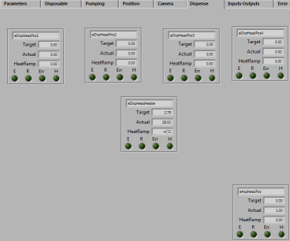
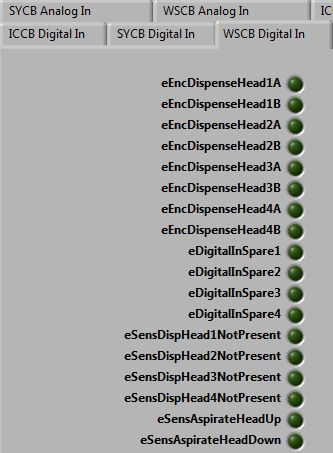

```{r setup, include=FALSE}
knitr::opts_chunk$set(echo = TRUE)
```

## Introduction
A user requirement for a pamservice tool to be used with 

* exising ps12 instruments
* new ps12 instruments

The requirements cover the graphical user interface (GUI) for servicing the ps12.

## Graphical User Interface
The requirements for a the GUI is outlined below and each tab is dealt with in each section.

## main tab
used to decide which board to connect


## parameters tab
used to see the flashed values of the parameters


## disposable tab
used to have livefeed of the disposable parameters


## position tab
used to have livefeed of the position parameters


## pumping tab
used to have livefeed of the pumping parameters


## camera tab
not used
used to control the camera


## dispense tab
used to have setting and getting



## input/outputs tab

used to get and set

* iccb (incubate board)
* sycb (system board)
* wsb (wash board)

## iccb (incubate board)

The following four tabs in one incube board tab.


Select all values button


## sycb (system board)

The following four tabs in one incube board tab.


## wsb (wash board)
The following four tabs in one wash board tab.




## error tab

